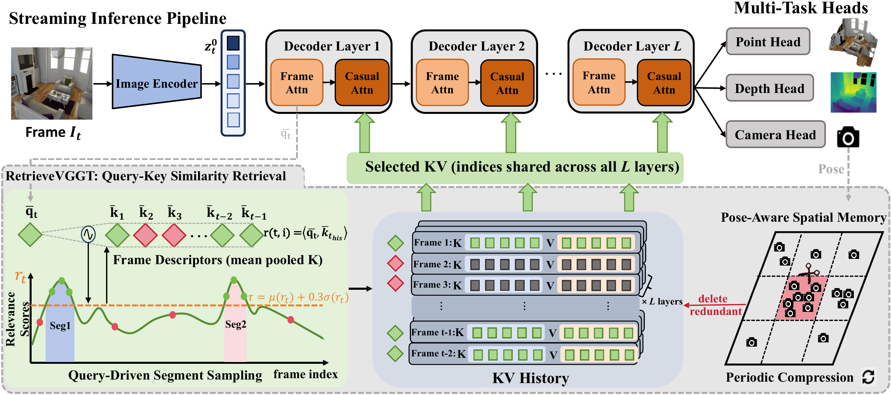

<h1 align="center">
  RetrieveVGGT: Training-Free Long Context Streaming 3D Reconstruction via Query-Key Similarity Retrieval
</h1>

<div align="center">
    <p>
        <a href="https://github.com/zzctmd">Zichen Zou,</a><sup>1</sup>&nbsp;&nbsp;
        <a href="https://github.com/jiaxiaosong1002">Xiaosong Jia,</a><sup>1</sup>&nbsp;&nbsp;
        <a>Zuxuan Wu,</a><sup>1</sup>&nbsp;&nbsp;
        <a>Yu-Gang Jiang</a><sup>1</sup>&nbsp;&nbsp;
    </p>
    <p>
        <sup>1</sup><a>Institute of Trustworthy Embodied AI (TEAI), Fudan University</a>&nbsp;&nbsp;
    </p>
</div>

<p align="center">
    <a href="https://arxiv.org/abs/2601.02281v1"></a>
    <a href="https://huggingface.co/papers/2601.02281"></a>
</p>

## 📰 News
- [May 2026] Paper release.
- [May 2026] Code release.

## 📖 Overview

We propose **RetrieveVGGT**, a **training-free streaming 3D reconstruction framework** that treats the construction of context for VGGT as a **retrieval problem**. For each incoming frame, RetrieveVGGT retrieves relevant frames from the entire history based on query-key similarity at the first global attention layer of VGGT, bounding memory to a fixed budget. We introduce **Segment Sampling** to enhance information diversity and a **pose-aware spatial memory** mechanism for scalable long-term memory management.

Our main contributions are summarized as follows:

1. A retrieval-based training-free streaming 3D reconstruction framework that enables dynamic attention to relevant historical keyframes with **constant memory cost regardless of sequence length**.
2. **Segment Sampling** and **pose-aware spatial memory** for enhanced selection diversity and scalable long-term memory management.
3. State-of-the-art performance on 3D reconstruction, video depth estimation, and camera pose estimation with **up to 20% improvement over existing streaming methods**, while maintaining bounded GPU memory consumption.

<div align="center">
    
</div>

---

## 🌍 Installation

1. Clone RetrieveVGGT
```bash
git clone https://github.com/AutoLab-SAI-SJTU/RetrieveVGGT.git
cd RetrieveVGGT
```

2. Create conda environment
```bash
conda create -n RetrieveVGGT python=3.11 cmake=3.14.0
conda activate RetrieveVGGT
```

3. Install requirements
```bash
pip install -r requirements.txt
conda install 'llvm-openmp<16'
```

> **Note**: `requirements.txt` pins `torch==2.3.1`. For a different CUDA version, install a compatible PyTorch first. See [PyTorch Get Started](https://pytorch.org/get-started/locally/).

4. Download Checkpoint
```bash
mkdir -p ckpt
huggingface-cli download lch01/StreamVGGT checkpoints.pth --local-dir ckpt/
```
Or manually download `checkpoints.pth` (~4.7 GB) from [Hugging Face](https://huggingface.co/lch01/StreamVGGT/) / [Tsinghua Cloud](https://cloud.tsinghua.edu.cn/d/d6ad8f36fcd541bcb246/) and place it in `ckpt/`.

---

## 📦 Dataset Preparation

### 7-Scenes

Download from the [official website](https://www.microsoft.com/en-us/research/project/rgb-d-dataset-7-scenes/) or use the [SimpleRecon script](https://github.com/nianticlabs/simplerecon/blob/477aa5b32aa1b93f53abc72828f86023b6e46ce7/data_scripts/7scenes_preprocessing.py#L43):

```bash
git clone https://github.com/nianticlabs/simplerecon.git /tmp/simplerecon
cd /tmp/simplerecon
python data_scripts/7scenes_preprocessing.py --data_dir /path/to/7scenes
```

Expected structure:

```
/path/to/7scenes/
├── chess/
│   ├── TestSplit.txt
│   ├── TrainSplit.txt
│   └── seq-01/
│       ├── frame-000000.color.png
│       ├── frame-000000.depth.png
│       ├── frame-000000.pose.txt
│       └── ...
├── fire/
├── heads/
├── office/
├── pumpkin/
├── redkitchen/
└── stairs/
```

Create symlink (recommended):

```bash
mkdir -p src/data
ln -s /path/to/7scenes src/data/7scenes
```

### Neural RGBD

Download:
```bash
bash data/download_nrgbd.sh /path/to/download
```

Preprocessing:
```bash
ln -s /path/to/download/neural_rgbd_data src/data/nrgbd
```

### Bonn RGB-D Dynamic

Download:
```bash
bash data/download_bonn.sh /path/to/download
```

Preprocessing:
```bash
python datasets_preprocess/prepare_bonn.py \
    --data_dir /path/to/download/bonn/rgbd_bonn_dataset \
    --output_dir src/data/long_bonn_s1/rgbd_bonn_dataset \
    --frames 50,200,300,400,500
```

### TUM freiburg3

Download:
```bash
bash data/download_tum_dynamics.sh /path/to/download
```

Preprocessing:
```bash
python datasets_preprocess/prepare_tum_dynamic.py \
    --data_dir /path/to/download/tum \
    --output_dir src/data/long_tum_dynamic_s1 \
    --frames 50,200,500,1000
```

---

## 🧪 Evaluation

All evaluation scripts are in `scripts/`. Each supports environment-variable overrides:

| Task | Script | Example |
|------|--------|---------|
| 3D Reconstruction | `scripts/run_recon.sh` | `GPU_ID=0 DATASET=nrgbd FRAMES="200 500" bash scripts/run_recon.sh` |
| Video Depth | `scripts/run_depth.sh` | `GPU_ID=0 DATASETS="bonn_s1_200 bonn_s1_500" bash scripts/run_depth.sh` |
| Camera Pose | `scripts/run_pose.sh` | `GPU_ID=0 DATASETS="tum_dynamic_s1_200 tum_dynamic_s1_500" bash scripts/run_pose.sh` |

### Quick Start: 7-Scenes 500-Frame

```bash
cd src/
CUDA_VISIBLE_DEVICES=0 python eval/mv_recon/launch_retrieve.py \
    --weights ../ckpt/checkpoints.pth \
    --dataset 7scenes \
    --size 518 \
    --output_dir ../eval_results/7scenes_500 \
    --max_frames 500 \
    --top_k 47 \
    --anchor 1 \
    --use_segment_sampling \
    --segment_threshold_mode "mean+0.3std"
```

Or simply: `bash scripts/run_recon.sh`

Results are saved in `eval_results/7scenes_500/7scenes/`. Average metrics are printed at the end:

```
avg Acc: X.XX, avg Comp: X.XX, avg NC1: X.XX, avg NC2: X.XX
```

### StreamVGGT Baseline (without retrieval)

```bash
cd src/ && bash eval/mv_recon/run.sh
```

### Key Parameters

| Parameter | Default | Description |
|-----------|---------|-------------|
| `--top_k` | 47 | Number of query-relevant historical frames to retrieve |
| `--anchor` | 1 | Number of anchor frames (always kept) |
| `--use_segment_sampling` | flag | Enable segment sampling for diverse coverage |
| `--segment_threshold_mode` | `mean+0.3std` | Similarity threshold for segment detection |
| `--max_frames` | 500 | Max frames to process per sequence |
| `--size` | 518 | Input resolution (518×392) |
| `--use_pose_aware` | flag | Enable Pose-Aware spatial region classification |
| `--use_kv_compression` | flag | Enable per-region KV compression |

**Total context window** = `top_k` + `anchor` = 47 + 1 = **48 frames** per step.

---

## 📂 Project Structure

```
RetrieveVGGT/
├── ckpt/                              # Checkpoints
│   └── checkpoints.pth
├── data/                              # Dataset download scripts
│   ├── download_nrgbd.sh
│   ├── download_bonn.sh
│   └── download_tum_dynamics.sh
├── datasets_preprocess/               # Long-sequence preprocessing
│   ├── prepare_bonn.py
│   └── prepare_tum_dynamic.py
├── scripts/                           # Evaluation entry points
│   ├── run_recon.sh                   # 3D Reconstruction (7-Scenes / NRGBD)
│   ├── run_depth.sh                   # Video Depth (Bonn)
│   └── run_pose.sh                    # Camera Pose (TUM Dynamic)
├── src/
│   ├── streamvggt/
│   │   ├── models/
│   │   │   ├── aggregator.py          # Aggregator with KV retrieval
│   │   │   └── streamvggt.py          # StreamVGGT model
│   │   └── streaming/
│   │       └── kv_repository.py       # ★ Core: KV cache storage & retrieval
│   ├── eval/
│   │   ├── mv_recon/                  # 3D Reconstruction evaluation
│   │   │   ├── launch_retrieve.py     # ★ RetrieveVGGT entry
│   │   │   └── launch.py             # StreamVGGT baseline
│   │   ├── video_depth/               # Video Depth evaluation
│   │   │   ├── launch_retrieve.py
│   │   │   └── eval_depth.py
│   │   └── pose_evaluation/           # Camera Pose evaluation
│   │       └── launch.py
│   ├── croco/                         # CroCo backbone
│   ├── dust3r/                        # DUSt3R utilities
│   └── vggt/                          # VGGT model components
├── requirements.txt
└── README.md
```

---

## 🔍 Recommendation
- Welcome to check out our related work [InfiniteVGGT](https://github.com/AutoLab-SAI-SJTU/InfiniteVGGT) and [FastVGGT](https://github.com/mystorm16/FastVGGT).

---

## 🙏 Acknowledgement
We would like to acknowledge the following open-source projects that served as a foundation for our implementation:

[CUT3R](https://github.com/CUT3R/CUT3R)
[VGGT](https://github.com/facebookresearch/vggt)
[Point3R](https://github.com/YkiWu/Point3R)
[StreamVGGT](https://github.com/wzzheng/StreamVGGT)
[TTT3R](https://github.com/Inception3D/TTT3R)

Many thanks to these authors!

---

## 📜 Citation

If you incorporate our work into your research, please cite:
```
@misc{yuan2026infinitevggt,
        title={InfiniteVGGT: Visual Geometry Grounded Transformer for Endless Streams}, 
        author={Shuai Yuan and Yantai Yang and Xiaotian Yang and Xupeng Zhang and Zhonghao Zhao and Lingming Zhang and Zhipeng Zhang},
        journal={arXiv preprint arXiv:2601.02281},
        year={2026}
}
```
